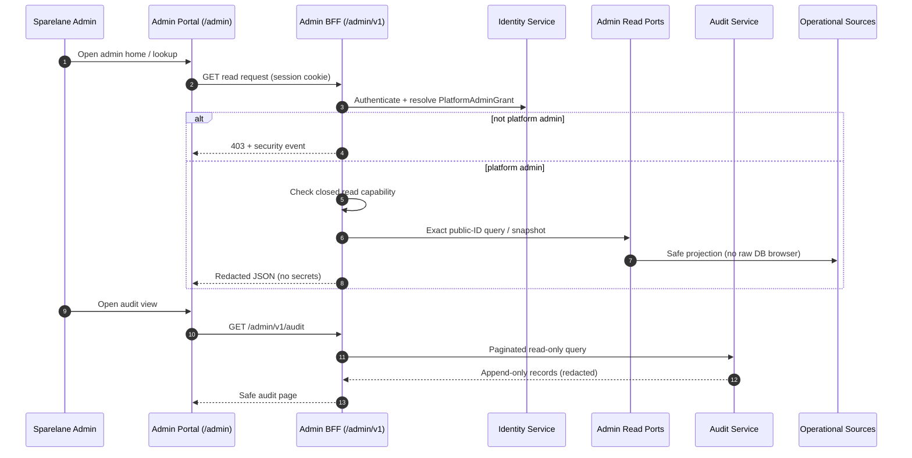

# Admin Read-Only Control Plane (H0)

## Purpose

H0 admin inspection: persisted platform-admin authority, server-side guard, safe read-only lookups — **no privileged mutations**, no DLQ replay, no grant management.

## Preconditions

- User with active `PlatformAdminGrant`
- Dev/test or future production IdP session (MFA production requirement tracked in OD-024)

## Mermaid

## Important invariants

- Persisted grant is sole admin authority — not merchant role, not env config.
- Deny-by-default capability checks — no wildcard.
- No mutation paths in H0 — privileged action sequence (SEQ-SEC-004) applies to **H1+**.
- No direct ledger edit — ADR-012/013 unchanged.
- Cross-tenant reads via admin read ports — not merchant context spoofing.

## Failure notes

- Anonymous → 401; authenticated non-admin → 403 + `security.authorisation_denied` per existing policy.
- Routine read success is **not** individually audited in H0.

## Related

LikeC4 dynamic view `adminReadOnlyControlPlane`. [ADR-032](../../decisions/ADR-032-platform-admin-authority-read-only-control-plane.md).
