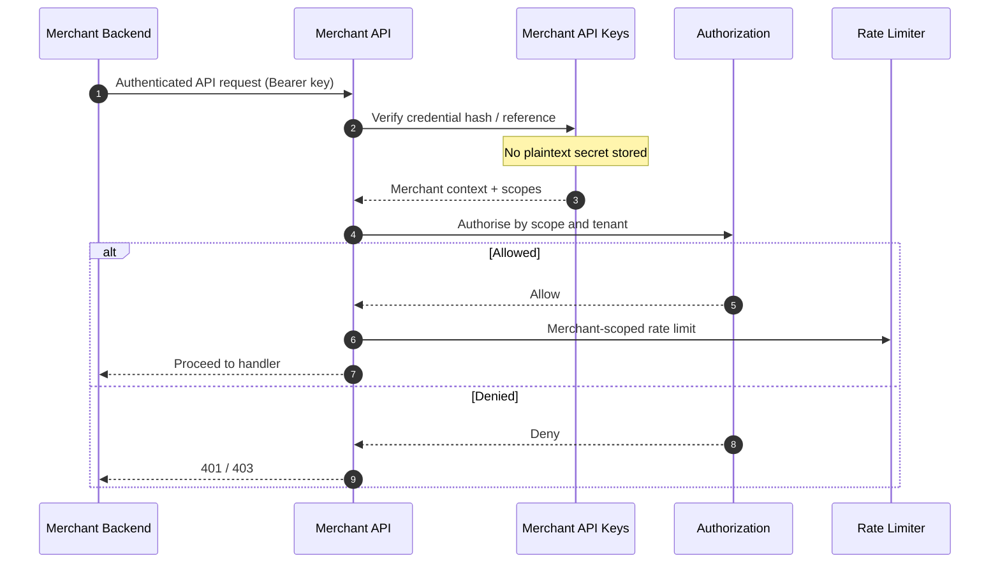

# Merchant API Authentication

## Purpose

Merchant machine authentication resolves a Bearer API key via hash/reference to merchant context and scopes, then authorises the request. Plaintext secrets are never stored.

## Preconditions

- Merchant issued an ACTIVE API credential (hash stored).
- Request includes `Authorization: Bearer …`.

## Mermaid

## Important invariants

- Only credential hashes/references stored (ADR-011).
- Tenant isolation enforced at authorisation (ADR-014).
- Distinct from merchant portal human sessions.

## Failure notes

- REVOKED / EXPIRED credentials fail auth.
- Scope mismatch fails even if key is valid.

## Related

LikeC4 dynamic view `merchantApiAuthentication`.
