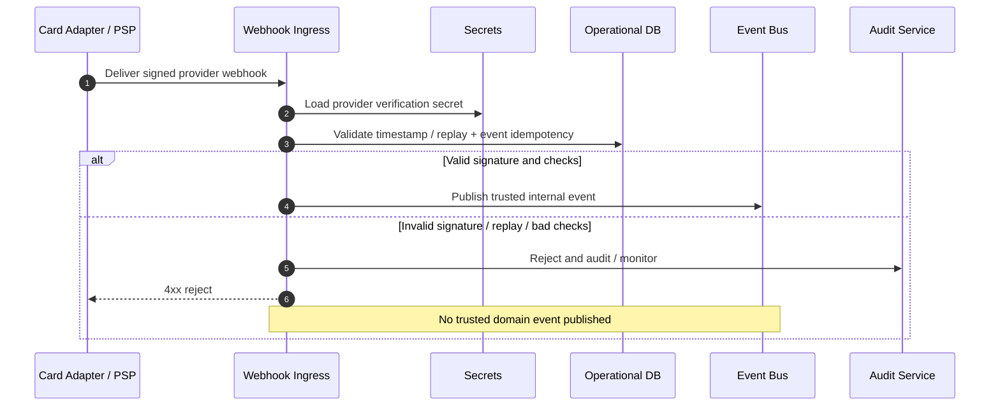

# Provider Webhook Verification

## Purpose

Provider webhooks are untrusted until signature, replay, and idempotency checks succeed. Invalid signatures are rejected and audited; only verified events become trusted internal domain events.

## Preconditions

- Provider webhook signing secret available via secrets management.
- Ingress endpoint reachable.

## Mermaid

## Important invariants

- Unverified webhooks must not mutate payment/settlement state.
- Reject path is audited.
- Idempotent handling of duplicate valid events.

## Failure notes

- Secret rotation must not drop verification (dual-secret window as designed).

## Related

LikeC4: `providerWebhookVerification`.
