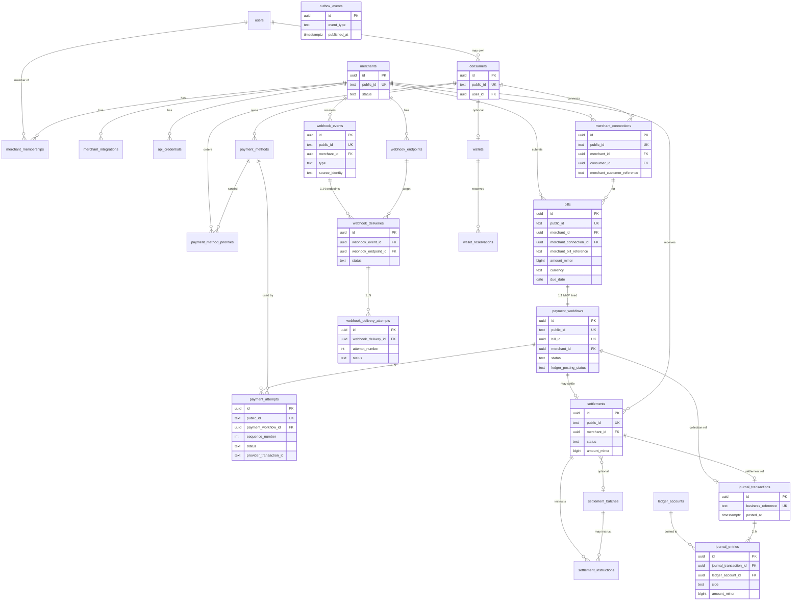

# Core ERD

Mermaid entity-relationship view of the core Sparelane relational model. Key fields only — not a full column catalogue.

```mermaid
erDiagram
  users ||--o{ consumers : "may own"
  users ||--o{ merchant_memberships : "member of"
  merchants ||--o{ merchant_memberships : "has"
  merchants ||--o{ merchant_integrations : "has"
  merchants ||--o{ api_credentials : "has"
  merchants ||--o{ webhook_endpoints : "has"
  merchants ||--o{ merchant_connections : "has"
  consumers ||--o{ merchant_connections : "connects"
  consumers ||--o{ payment_methods : "owns"
  consumers ||--o| wallets : "optional"
  consumers ||--o{ payment_method_priorities : "orders"
  payment_methods ||--o{ payment_method_priorities : "ranked"
  merchants ||--o{ bills : "submits"
  merchant_connections ||--o{ bills : "for"
  bills ||--|| payment_workflows : "1:1 MVP fixed"
  payment_workflows ||--o{ payment_attempts : "1..N"
  payment_methods ||--o{ payment_attempts : "used by"
  payment_workflows ||--o| settlements : "may settle"
  merchants ||--o{ settlements : "receives"
  settlements }o--o| settlement_batches : "optional"
  settlements ||--o{ settlement_instructions : "instructs"
  settlement_batches ||--o{ settlement_instructions : "may instruct"
  ledger_accounts ||--o{ journal_entries : "posted to"
  journal_transactions ||--|{ journal_entries : "2..N"
  payment_workflows ||--o| journal_transactions : "collection ref"
  settlements ||--o| journal_transactions : "settlement ref"
  merchants ||--o{ webhook_events : "receives"
  webhook_events ||--o{ webhook_deliveries : "1..N endpoints"
  webhook_endpoints ||--o{ webhook_deliveries : "target"
  webhook_deliveries ||--o{ webhook_delivery_attempts : "1..N"
  wallets ||--o{ wallet_reservations : "reserves"

  merchants {
    uuid id PK
    text public_id UK
    text status
  }
  consumers {
    uuid id PK
    text public_id UK
    uuid user_id FK
  }
  merchant_connections {
    uuid id PK
    text public_id UK
    uuid merchant_id FK
    uuid consumer_id FK
    text merchant_customer_reference
  }
  bills {
    uuid id PK
    text public_id UK
    uuid merchant_id FK
    uuid merchant_connection_id FK
    text merchant_bill_reference
    bigint amount_minor
    text currency
    date due_date
  }
  payment_workflows {
    uuid id PK
    text public_id UK
    uuid bill_id UK
    uuid merchant_id FK
    text status
    text ledger_posting_status
  }
  payment_attempts {
    uuid id PK
    text public_id UK
    uuid payment_workflow_id FK
    int sequence_number
    text status
    text provider_transaction_id
  }
  settlements {
    uuid id PK
    text public_id UK
    uuid merchant_id FK
    text status
    bigint amount_minor
  }
  journal_transactions {
    uuid id PK
    text business_reference UK
    timestamptz posted_at
  }
  journal_entries {
    uuid id PK
    uuid journal_transaction_id FK
    uuid ledger_account_id FK
    text side
    bigint amount_minor
  }
  webhook_events {
    uuid id PK
    text public_id UK
    uuid merchant_id FK
    text type
    text source_identity
  }
  webhook_deliveries {
    uuid id PK
    uuid webhook_event_id FK
    uuid webhook_endpoint_id FK
    text status
  }
  webhook_delivery_attempts {
    uuid id PK
    uuid webhook_delivery_id FK
    int attempt_number
    text status
  }
  outbox_events {
    uuid id PK
    text event_type
    timestamptz published_at
  }
```
