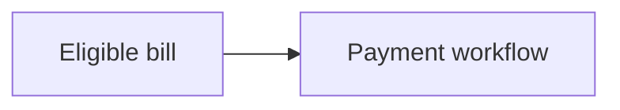

# REQ-000 — Short descriptive title

## Requirement

State the required behaviour or quality in one or two sentences. Use “must” / “must not” carefully.

## Rationale

Why this requirement exists (product, risk, ADR, regulation). Link ADRs in frontmatter when binding.

## Acceptance Criteria

- Observable criterion 1
- Observable criterion 2

## Notes

Optional diagrams (Mermaid), open decisions (path links), or implementation caveats.

